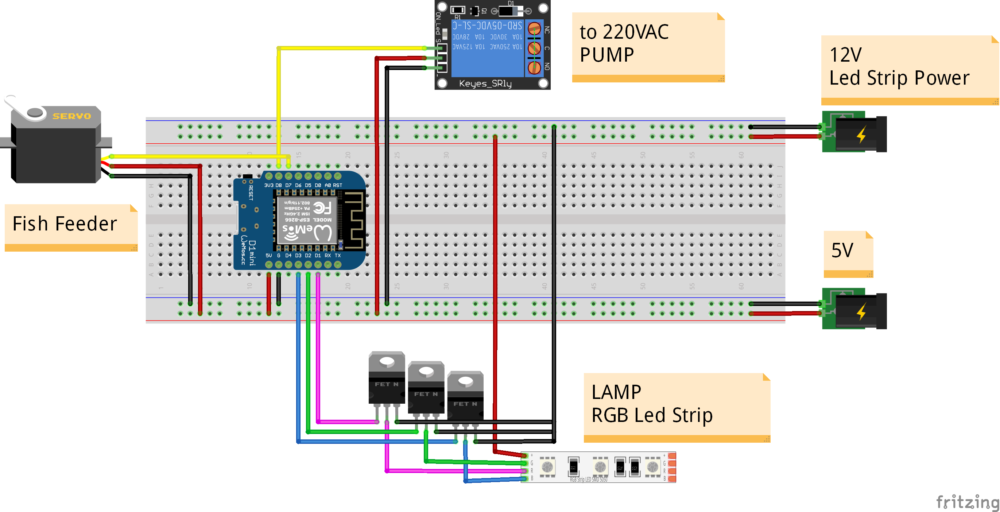
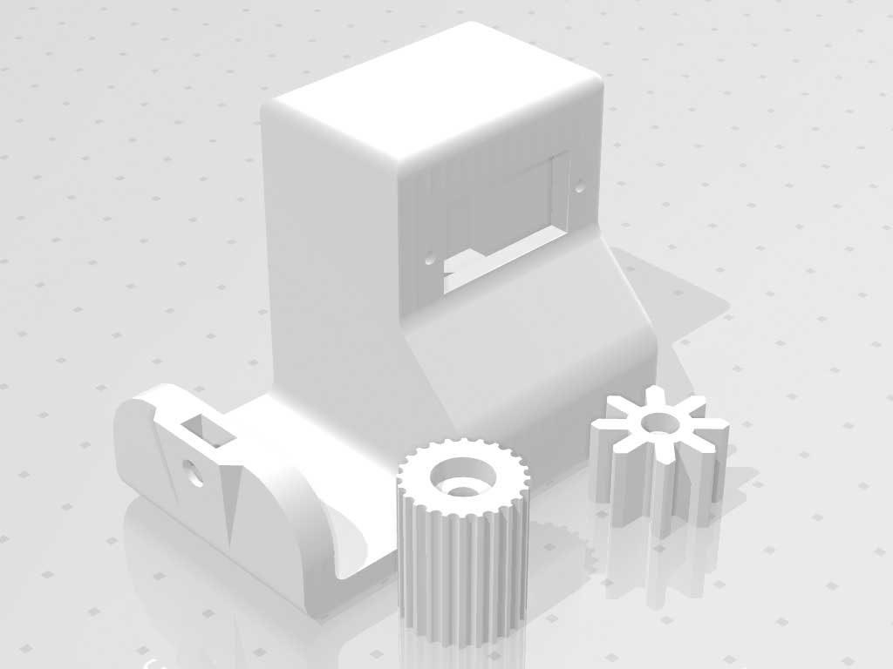
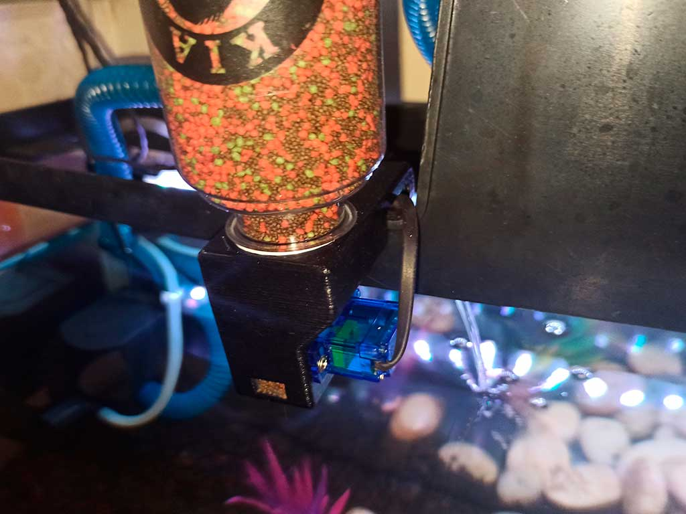
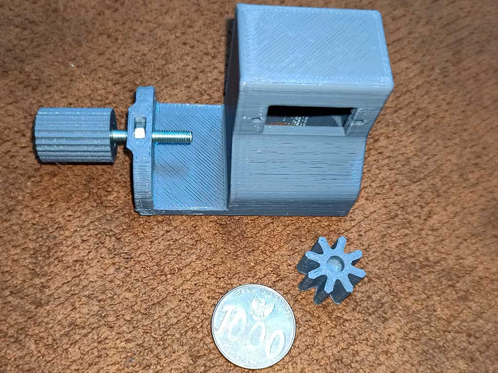

# ESP8266-AQUARIUM-CONTROLLER-Fish-Feeder
Control aquarium with ESP8266 - Fish Feeder, Lamp, Pump

## Feature
- Wifi connection
- Web base admin
- Offline / Online mode
- Standalone (required NTP connection in online mode)
- Pump control (ON/OFF).
- Fish feeder schedule.
- RGB lamp control & schedule ON/OFF in online mode.

## Demo
> video will be uploaded soon...

## Instalation guide
> video will be uploaded soon...
- Install arduino IDE from [arduino web](https://www.arduino.cc/)
- Upload sketch :
	- Add ESP8266 board to arduino IDE [check here](https://github.com/esp8266/Arduino)
	- Upload sketch
- Upload HTML file:
	- Install filesystem plugin to arduino IDE [check here](https://github.com/esp8266/arduino-esp8266fs-plugin)
	- Upload HTML file
	> NOTE:  
	> When uploading filesystem make sure the serial monitor (arduino IDE) is closed

## Components
- ESP8266 board (Wemos, nodemcu, etc)
- Led strip 12v (common anode)
- Mosfet N channel (can use ULN2003 if using short led strip/ low ampere)
- Servo SG90
- Relay modul / shield
- Mechanical feeder (use 3D printer, check model in 3D folder)
- 12V Power supply
- 5V power supply (or use step down 12v to 5v)
- Box (optional, check model in 3D folder)

## Wiring

 - D1 : Red led strip
 - D2 : Green led strip
 - D3 : Blue led strip
 - D7 : Servo
 - D8 : Relay

## Mechanical Feeder
Mechanical feeder remixes from [here](https://www.thingiverse.com/thing:2921447)

## Usage
Default setting is offline mode (device becomes wifi access point) :
- Connect to board with wifi 
	- Default SSID = AQUARIUM
	- No password
- Open web address http://10.10.10.10/
> NOTE:  
> ESP8266 is low processor, too many web connections will be slow.

Set up wifi connection and NTP to change online mode.  
- offline mode ==> schedule feeders based on duration.
- online mode ==> schedule feeders based on time.

If internet connection down or can't get time from NTP server, it will auto switch to offline mode, and duration calculated from last feed.  

## License and credits
My code under MIT license, other libraries follow their own license.
- Timer.h
- NTPClient.h
- Jquery.js
- Bootstrap
- etc...

